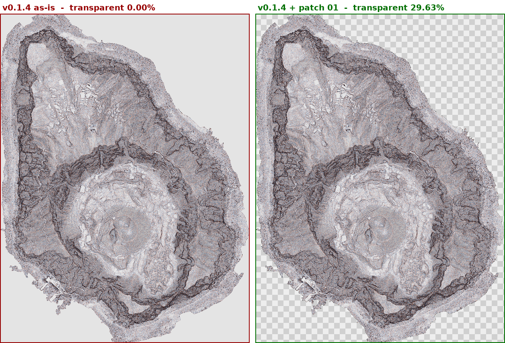

# NoData（データの無い範囲）の扱い

**このパイプラインで最も事故が起きやすい箇所。**
NoData が正しく透明になっていないと、データの無い範囲（海、対象外の市町村、
LiDAR の欠測域）が不透明に塗り潰され、地図に重ねたとき下のレイヤが見えなくなる。

**結論を先に:**

1. **DEM に NoData が宣言されていることが前提。** 宣言が無いと透明化できない
2. **本家の csmap-py は NoData を透明化しない。** `patches/01-nodata-transparency.patch` が必須
3. WebP化しても透明は完全に保たれる（アルファは可逆で符号化される）

---



左: 本家 v0.1.4 のまま（海が塗り潰されている） / 右: パッチ適用後（市松模様が透明部分）。
入力DEM・パラメータは同一で、csmap-py のコードだけが異なる。

---

## 1. 実例: 東京都島しょ部の作り直し

2024-03 に生成したタイルは海域が塗り潰されていたため、2025-05 に作り直した。

青ヶ島（shima-06）で比較した結果:

| | 透明 | 不透明 |
|---|---|---|
| 旧 2024-03 | **0.1%** | 99.9% |
| 新 2025-05 | **29.7%** | 70.3% |

バンド構成（RGBA 4バンド、Mask Flags: PER_DATASET ALPHA）は新旧とも同一で、
**構造だけでは判別できない。中身の統計を見ないと気づけない。**

### 何が修正されたか

DEM も GDAL のコマンドも変わっていない。**`csmap-py` の `process.py` を修正した**（2025-05-11）。

| ファイル | 更新日 | 内容 |
|---|---|---|
| `calc.py` | 2024-03-03 | float64キャスト（島しょ初回生成の前から適用済み。今回の原因ではない） |
| **`process.py`** | **2025-05-11** | **← これが修正** |

同じDEM・同じパラメータで、csmap-py のコードだけを入れ替えて検証した:

| csmap-py | 透明率 |
|---|---|
| 本家 0.1.4 素のまま | **0.0%** |
| 本家 0.1.4 + パッチ | **29.6%** |
| 2025年版（正解） | 29.6% |

---

## 2. なぜ透明にならないのか

GeoTIFF では「データが無い」ことを**巨大な数値**で表す。今回のDEMは `1.70141e+38`。
ファイルには「この値は無効」という宣言（`NoData Value=`）が別に書いてある。

```
海の画素:  [1.7e+38, 1.7e+38, 1.7e+38, ...]
```

**本家の csmap-py はこの宣言を読まない。** そのため巨大値を標高の実測値として扱い、
海にも地形を描画してしまう。

```python
# 本家: 宣言を無視して生の値を読む
chunk = dem.read(1, window=Window(x, y, chunk_size, chunk_size))
```

さらに `np.isnan(1.70141e+38)` は `False` なので、
「データ無しの位置」を後から特定することもできない。

---

## 3. パッチの内容

パッチは2つに分かれている。**NoData の透明化には `01` だけで足りる。**

| パッチ | 内容 | 本家テスト |
|---|---|---|
| `patches/01-nodata-transparency.patch` | NoData の透明化（①②） | ✅ 3 passed |
| `patches/02-float64-slope.patch` | float32オーバーフロー回避（③） | ❌ 3 failed |

`02` は出力が丸め誤差レベルで変わり（最大1/255・該当画素0.000%）、
本家のフィクスチャ比較を壊すため**本家への提案からは除外**している。
既存データセットを画素単位で再現する用途でのみ適用する
（適用しない場合、859万画素中27画素が相違）。

### ① DEM読み込み時に NoData を NaN に置き換える（`process.py`）

```python
def _read_chunk(dem, window):
    chunk = dem.read(1, window=window, masked=True)   # NoData宣言を参照してマスク
    if not np.issubdtype(chunk.dtype, np.floating):
        chunk = chunk.astype("float32")               # 整数型はNaNを保持できない
    return chunk.filled(np.nan)                       # マスク位置をNaNに
```

**整数型のDEMでは `float32` への昇格が必須。**
これが無いと `TypeError: Cannot convert fill_value nan to dtype int16` で落ち、
出力が全面透明になる。float64 のDEMは精度を落とさないようそのまま扱う。

`NaN` は "Not a Number"（数値でない）の意味で、**欠測を表す標準的な印**。
ゼロや巨大値と違って計算に紛れ込まず、`np.isnan()` で位置を正確に拾える。

```
修正前: [1.7e+38, 1.7e+38, ...]   ← 標高1.7×10³⁸mの地点として計算される
修正後: [    nan,     nan, ...]   ← 欠測として扱われる
```

### ② NaN の位置のアルファを 0 にする（`process.py`）

```python
out_h, out_w = csmap_chunk_margin_removed.shape[1:]
off_y = (chunk.shape[0] - out_h) // 2
off_x = (chunk.shape[1] - out_w) // 2
nodata_mask = np.isnan(chunk)[off_y : off_y + out_h, off_x : off_x + out_w]
csmap_chunk_margin_removed[3, nodata_mask] = 0
```

①で NaN になった位置を拾って透明にする。**①が無いと空振りする**
（実際に②だけ当てて検証したところ透明0.0%のままだった）。

CS立体図の生成では縁が削られるため、マスクも同じだけ切り詰めて
出力配列とサイズを揃える必要がある。削られる幅は入力 `chunk` と出力の
**形状差から求めている**ので、パディングやフィルタサイズの実装が変わっても追従する。

### ③ float32 のオーバーフローを避ける（`calc.py`）

```python
p = ((z6 - z4) / 2).astype(np.float64)
q = ((z8 - z2) / 2).astype(np.float64)
```

巨大値が残っている場合、`p * p` が float32 の上限（3.4e38）を超えて `inf` になり、
傾斜の計算が壊れる。①で NaN 化していれば直接の実害は減るが、
NoData 宣言の無いDEMを扱う際の保険として残す。

### 適用方法

```bash
python3 -m venv csmapenv
./csmapenv/bin/pip install csmap-py==0.1.4
cd csmapenv/lib/python3*/site-packages
patch -p1 < /path/to/patches/01-nodata-transparency.patch
patch -p1 < /path/to/patches/02-float64-slope.patch   # 既存データを再現する場合のみ
```

### 検証結果

| 項目 | 結果 |
|---|---|
| 実データ（float32 / 1.70141e+38） | 0.0% → 29.63%、正解と画素単位で完全一致 |
| NoData値・型 6パターン | すべて正常 |
| 本家テストスイート | ✅ 3 passed（`01` のみ適用時） |
| 並列処理（max_workers=4） | 逐次と画素差0 |
| NoData宣言なしDEM | 退行なし（本家テストが通過） |
| 性能 | 0.99秒 → 0.66秒 |
| メモリ | 220MB → 226MB（+2.5%） |

> 本家 [MIERUNE/csmap-py](https://github.com/MIERUNE/csmap-py) には
> このパッチは取り込まれていない（v0.1.4 / 2025-01-07 時点で確認）。

---

## 4. DEM の NoData はどうなっていればよいか

**必須条件はひとつだけ。「NoData が宣言されていること」。**

```bash
gdalinfo dem.tif | grep NoData
#   NoData Value=-9999    ← この行があればOK。無ければNG
```

**値は何でもよい。** パッチはファイルの宣言を読むだけなので、以下はいずれも動作に影響しない。

- NoData の**値**が整数か小数か（−9999 / −32768 / 1.70141e+38 / NaN）
- DEM の**データ型**が整数か浮動小数点か（int16 / int32 / uint16 / float32 / float64）

整数型の DEM は内部で float32 に昇格して処理される。

> **実務では整数型のDEMはまず出てこない。**
> 航空レーザ測量由来のDEM（0.25〜1m）は標高を整数に丸める理由がないため Float32 になる。
> 本リポジトリで扱う11データセットも確認した範囲ですべて Float32 だった。
> 整数型が出るのは SRTM / ASTER GDEM / GEBCO のような全球データ（Int16、メートル単位）。
>
> それでも整数型に対応させているのは、**未対応だとクラッシュするため**。
> `.filled(np.nan)` が `TypeError` を投げ、出力ファイルは作られるが中身が書かれず
> 全面透明という気づきにくい壊れ方をする。機能追加ではなく事故防止の位置づけ。

| 型 | NoData値 | 結果 |
|---|---|---|
| float32 | −9999 | ✅ |
| float32 | NaN | ✅ |
| float32 | 1.70141e+38 | ✅ |
| int16 | −9999 | ✅ |
| int32 | −32768 | ✅ |
| uint16 | 65535 | ✅ |

**ただし `0` は避ける。** 動作はするが、標高0m（海面）と区別できず、
本物の0m地点まで透明になる。

### 実務での判断

1. **配布元の値をそのまま使う。** 変更する理由はない
2. 宣言が無いときだけ後付けする
3. 一度宣言すれば VRT・統合を経ても保たれる。最初のDEMさえ正しければ以降は不要

新規に自分で決める場合の推奨は、浮動小数点なら **−9999**、整数型なら **−9999 か −32768**。

---

## 5. DEM に NoData の宣言が必要（実証）

**画素値が同じでも、宣言の有無だけで結果が変わる。**

同一のDEMから宣言だけを外して検証した結果:

| DEM | NoData宣言 | 出力の透明率 |
|---|---|---|
| そのまま | `1.70141e+38` | **6.9%** |
| 宣言を外す | なし | **0.0%** |

### 確認方法

```bash
gdalinfo <DEM.tif> | grep -E 'NoData|Mask Flags'
```

`NoData Value=` が出てこなければ宣言が無い。

### 宣言が無い場合の対処

どちらの方法でも透明化できることを確認済み（いずれも 6.9% で一致）。

```bash
# 方法1: 既存ファイルに宣言を後付けする（画素値は書き換えない）
gdal_edit.py -a_nodata 1.70141e+38 <DEM.tif>

# 方法2: VRT作成時に指定する
gdalbuildvrt -srcnodata 1.70141e+38 -vrtnodata 1.70141e+38 \
  -input_file_list filelist.txt out.vrt
```

NoData値は配布元の仕様に合わせる（`1.70141e+38`、`-9999`、`-32768` など）。
**`0` を NoData にする場合は注意。** 標高0mの海面と区別がつかなくなる。

### VRT・統合を経ても宣言は保たれる

実際のパイプラインで確認済み。

| 段階 | NoData |
|---|---|
| 元DEM（配布ファイル） | `1.70141e+38` |
| VRT（`gdalbuildvrt`） | `1.70141e+38` |
| 統合DEM（`gdal_translate`） | `1.70141e+38` |

元が宣言していれば、途中で失われることはない。

---

## 6. WebP でも透明は完全に保たれる

**WebP は非可逆モード（q=95）でも、アルファチャンネルは可逆で符号化される。**

同一の CS立体図から PNG と WebP のタイルを生成して比較した結果:

| 項目 | 結果 |
|---|---|
| 比較タイル数 | 12 |
| **アルファの最大差** | **0（完全一致）** |
| RGBの平均差（不透明部） | 2.08 / 255（0.8%） |
| 容量 | 528KB → 212KB |

透明率も PNG と完全に一致した（33.9% / 70.3% / 61.7%）。
**NoData に関して WebP化によるリスクは無い。**

---

## 7. 検証方法

```bash
bash scripts/98-check-nodata.sh <GeoTIFF または タイルディレクトリ>
```

判断の目安:

| 透明の割合 | 判断 |
|---|---|
| 1%未満 | ⚠ **NoDataが透明化されていない可能性が高い** |
| 数%〜数十% | 正常。海岸線や範囲境界が透明になっている |
| 95%以上 | ⚠ データが入っていない可能性 |

対象範囲が矩形に完全に収まるデータ（内陸を矩形で切り出した場合など）では
1%未満が正しいこともある。**対象地域の形状と照らして判断すること。**

タイルディレクトリを渡した場合は「部分透明タイル（1〜99%）」の有無で判定する。
境界タイルが1枚も部分透明でなければ、透明化が効いていない可能性が高い。

---

## 8. チェックリスト

- [ ] 元DEM に NoData が宣言されているか（`gdalinfo | grep NoData`）
- [ ] csmap-py に `patches/01-nodata-transparency.patch` を適用したか
- [ ] CS立体図 GeoTIFF が RGBA 4バンドになっているか
- [ ] アルファの透明率が対象地域の形状と整合するか（`98-check-nodata.sh`）
- [ ] 生成タイルが 4バンドを保っているか
- [ ] 実際に地図に載せて、海や範囲外が透けて見えるか

最後の目視確認は省略しない。統計上は正常でも、範囲の切り出しミスは目で見ないと気づけない。
